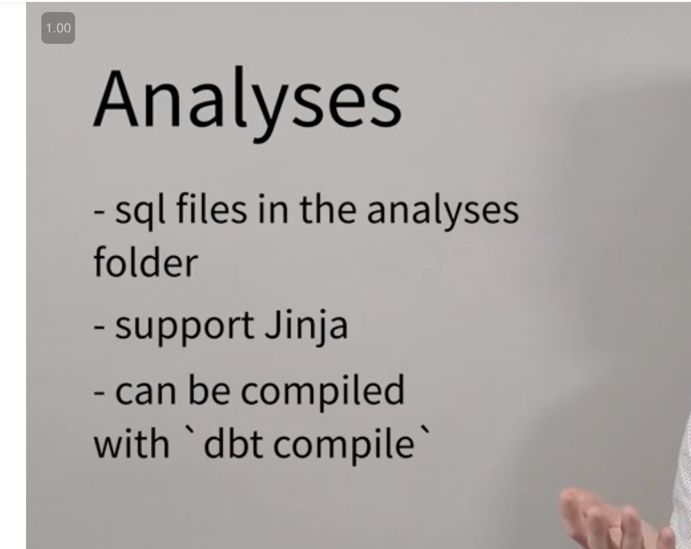
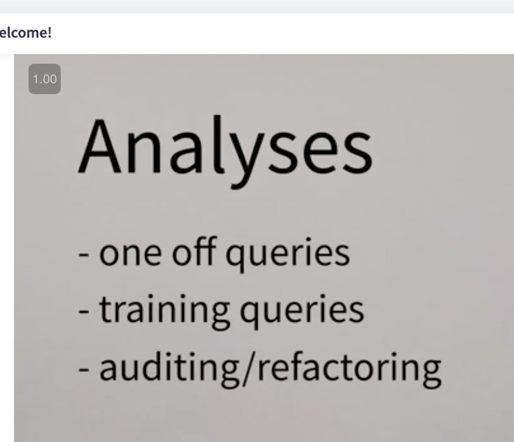
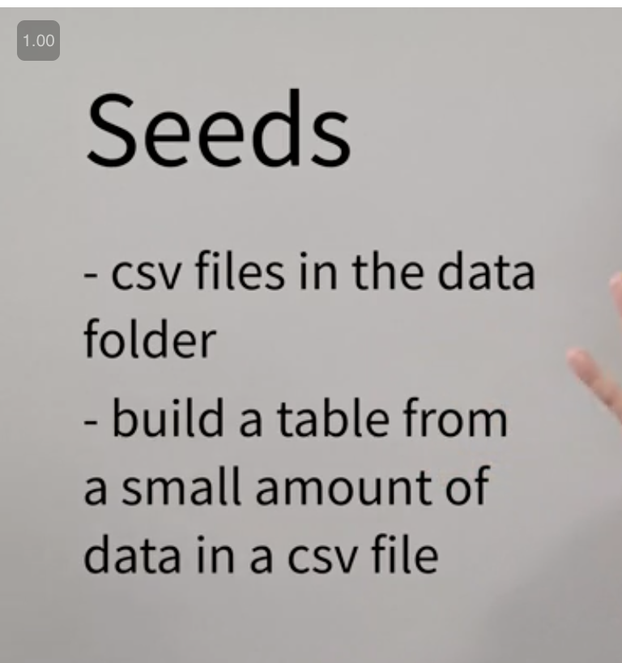
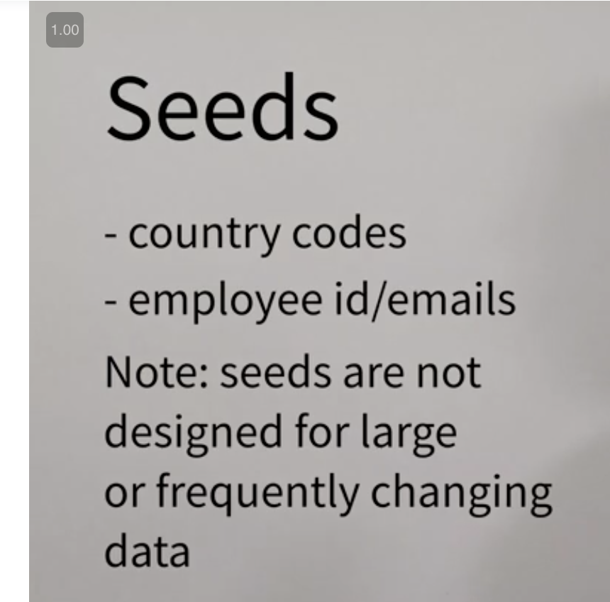
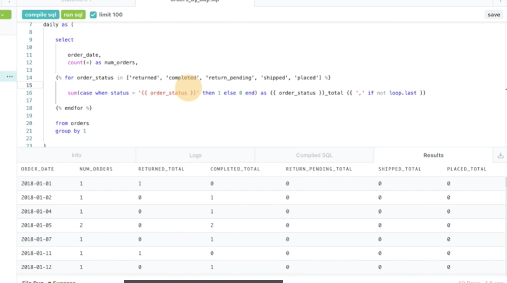
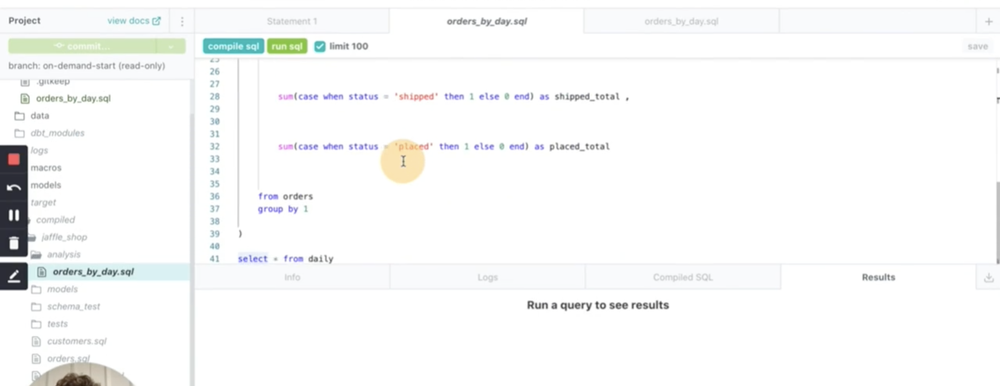
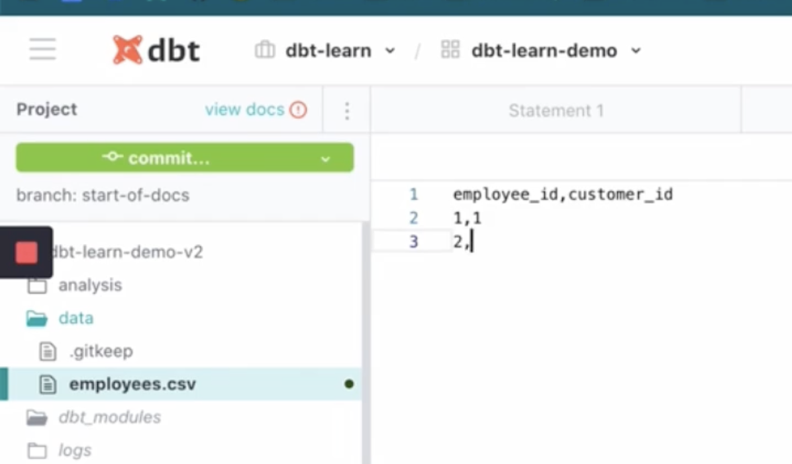
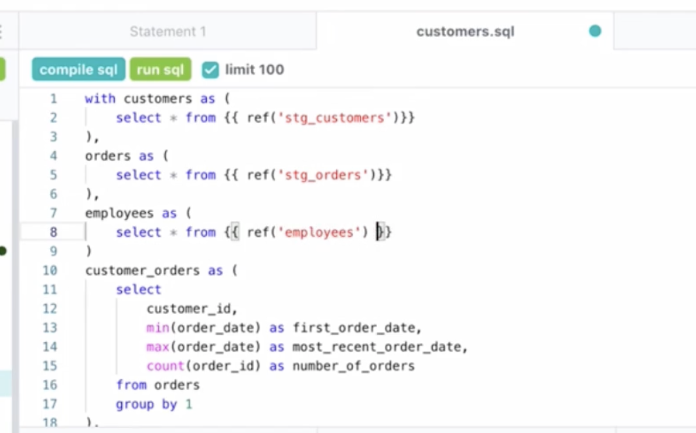
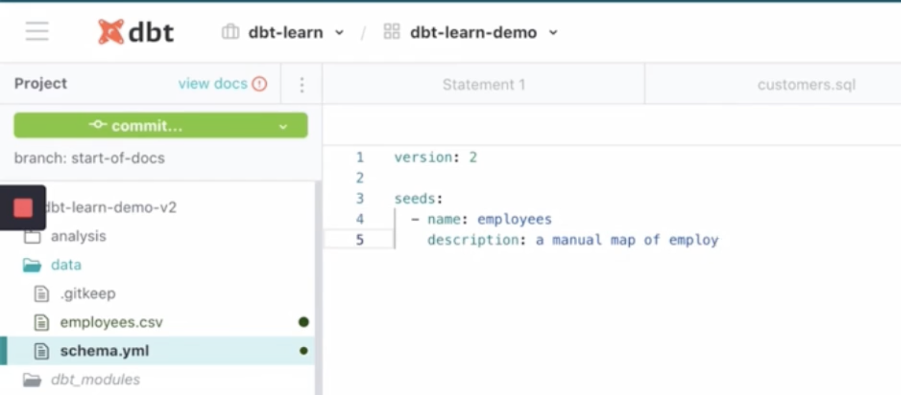
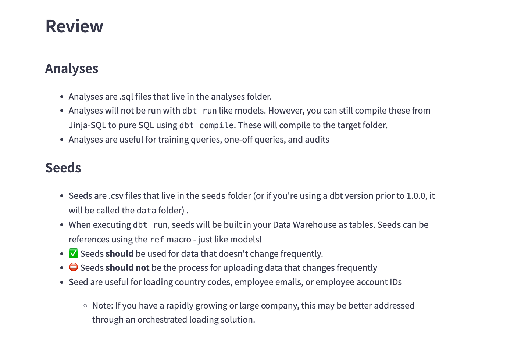

# <https:§§courses.getdbt.com§courses§analyses-seeds>
> <https://courses.getdbt.com/courses/analyses-seeds>

## Analyses and Seeds

### Learning Objectives
Explain the purposes of analyses in contrast to models
Explain the role of seeds in a dbt project
Write and compile analyses and find the compiled SQL in the targets folder
Add a seed to a project and materialize in the data warehouse
Select from, test, and documents seeds

### What are analyses?




### What are seeds?

load smal static data from csv

`dbt seed`



### Implementing analyses


dbt compile and get analysis into the folder


### Implementing seeds


dbt seed to materialize the table
use as usual using ref

add yml


### Practice

```csv
employee_id,email,customer_id
3425, mike@jaffleshop.com, 1
2354, sarah@jaffleshop.com, 6
2342, frank@jaffleshop.com, 8
1234, jennifer@jaffleshop.com, 9
```

### Exemplar

```sql
with payments as (
select * from {{ ref('stg_payments') }}
),

aggregated as (
select
sum(amount) as total_revenue
from payments
where status = 'success'
)

select * from aggregated
```

### Review



