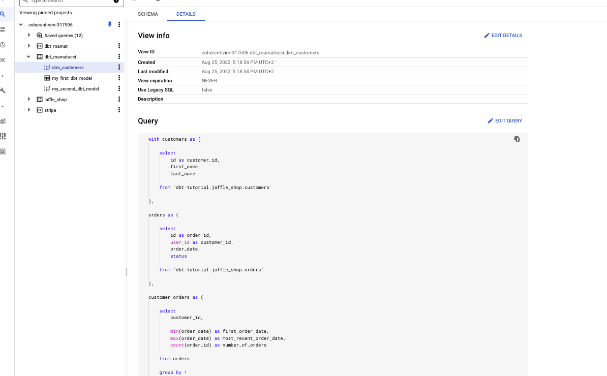
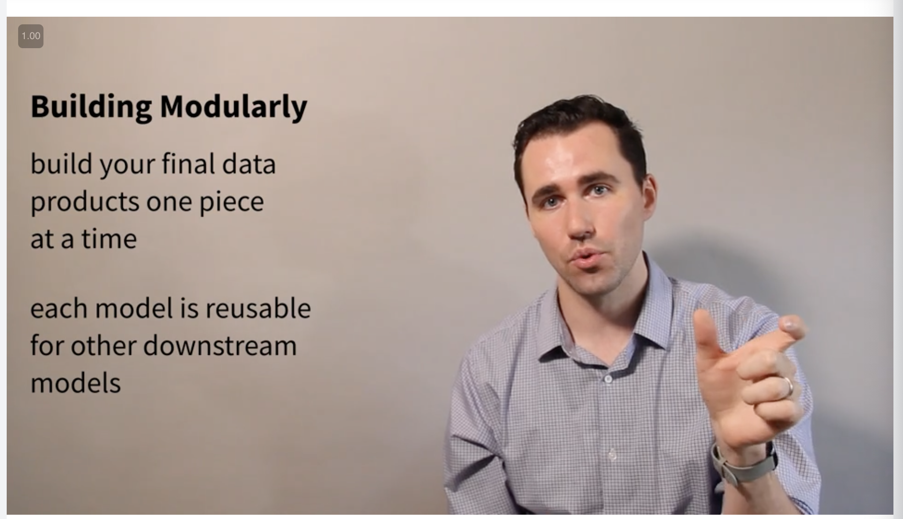
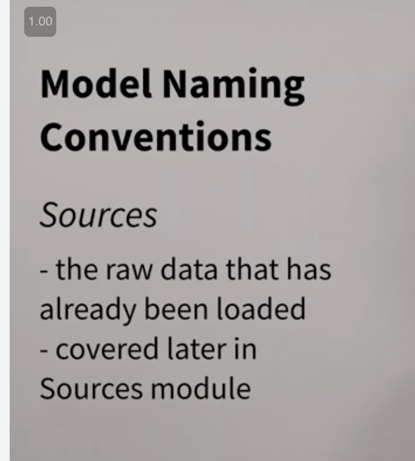
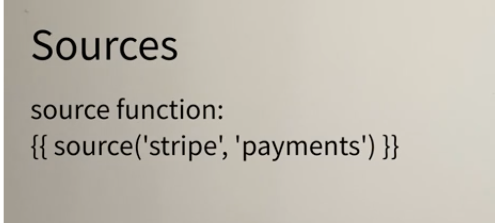

# <https:§§courses.getdbt.com§courses§fundamentals>
> <https://courses.getdbt.com/courses/fundamentals>
        
dbt Fundamentals

Welcome to dbt Fundamentals (4 minutes)
Who is an analytics engineer? (20 minutes)
Set up dbt Cloud (17 minutes)
Models (28 minutes + exercise)
Sources (12 minutes + exercise)
Tests (17 minutes + exercise)
Documentation (16 minutes + exercise)
Deployment (11 minutes + exercise)
Survey and Next Steps (30 minutes)


## Welcome to dbt Fundamentals (4 minutes)

use dbt for transformartion
five key topics
- models
- sources
- tests
- documentation
- deployment

video and practice
exampler page
review page
quiz

dbt docs for reference

community

channel in slack ` learn on demand` channel


### faq

5 hours to complete the course
you get dbt fundamental badge
https://docs.getdbt.com/
https://community.getdbt.com/

general feedback/error reporting on contents training@dbtlabs.com

## Who is an analytics engineer? (20 minutes)

objectives
- data teams structure
- transition from etl to elt
- role of analytics eng
- dbt in modern data stack
- structure of dbt project

### Traditional Data Teams

data analysts and data eng 


data anlatyst query tables created by data eng
create reports
2 roles 
gap between them
data analyst know what to build
data eng know how to build it
rethink what a data team could be with dbt

### ETL and ELT

so far etl
extract some data
transforma some data
load some data 
etl managed by data eng
few additional skills sql, pythin etc
data is built, then more tools are needed for data update automation process

now edw are on the cloud
they can scale when needed

now for elt
extract
load and then transform
we focus now first for E and L
when data in there in the edw then we can focus on the T
`game changer`


new role of analytic eng
rethink how data team works together

### Analytics Engineer

https://www.getdbt.com/what-is-analytics-engineering/

new role analytics eng
focus on taking raw data and tranf data so data analyst to use
focus on the T
data eng focus on EL and mantain infra


no silo-ed people 
1 person can cover all of them

### The modern data stack and dbt

data sources 

data paltform
// store the data 
use dbt cloud or dbt core with adaptors

loaders
// move data from soruces to data platform

bi tools and ml model and op analytics
// use the data


dbt fits into


develop T pipeline usign sql-like statements def models creating dep between models

visualize with the graph


develope the model 
test the model
before shipping the model to run on prod data
write doc of the model
deploy the dbt project when ready


### Overview of an exemplar project

use sample prj to learn dbt

 - yml 
 to ake aware dbt of tables 
 - sql
 model to stage the data


lienage shows how models are dep on other models and navigate on each of these
stg are staging tbale
fct and dim are finale models
`dbt run` to build to actaul model

`dbt test` to run test
- yml
def test to be sure of the data quality incoming

`dbt docs genearte` gen docs for the models
you have lineage graph 

deplyment
use env def in dbt cloud
and merge code to master etc

### review


## Set up dbt Cloud (17 minutes)

### Learning Objectives

Load training data into your data platform
Set up an empty repository and connect your GitHub account to dbt Cloud.
Set up your warehouse and repository connections.
Navigate the dbt Cloud IDE.
Complete a simple development workflow in the dbt Cloud IDE.


### dbt, data platforms, and version control

you have dbt cloud and dbt core

dbt connects to a data platform
https://docs.getdbt.com/docs/supported-databases/

use of github or others
https://docs.getdbt.com/docs/dbt-cloud/cloud-configuring-dbt-cloud/cloud-using-a-managed-repository

### Setting up dbt Cloud and your data platform

advice of getting access to one of the follow data platforms: BigQuery, Databricks, Redshift, or Snowflake.

https://docs.getdbt.com/guides/getting-started/getting-set-up/setting-up-bigquery

### dbt Cloud IDE Overview

https://cloud.getdbt.com/ide/#/accounts/88876/projects/136002/develop/
yml and sql are the ones used
`dbt_project.yml` needed in order to run dbt itself


we have sql runner  in the `scratchpad`

use preview and compile


preview shows what the compile will be in actual execution
copile shows the raw sql code 

use of jinja macros

model are in sql

use of lineage shows models dep 

you have cmd line interface to run cmds

the changes are committed like in git

uncommitted files have blue dots

use `__` to access to auto-complete 

### Overview of dbt Cloud UI


dev env, prod env


projects


your profile is https://cloud.getdbt.com/#/profile/

integrations
api keys 


### Review


### CFU


## Models (28 minutes + exercise)

Explain what models are in a dbt project.
Build your first dbt model.
Explain how to apply modularity to analytics with dbt.
Modularize your project with the ref function.
Review a brief history of modeling paradigms.
Identify common naming conventions for tables.
Reorganize your project with subfolders.

### What are models?

models means to shape the data from what you have to what you need
in dbt models are just sql
piece of logic

###  Building your first model

under the `models` folder


you configure what models to be table or view
ddl amd dml are generated by dbt

https:§§courses.getdbt.com§courses§fundamentals/dim_customers.sql


```
dbt run

dbt run -m modelxyz
```

get new model  


or 


```
{{ config (
    materialized="table"
)}}
```
to change from view to table


### What is modularity?

- use ctes
- use final to get out data


first model stg models

take underlaying data and shape a bit

final model refactor and select from stg models

assemble the various parts




### Modularity and the ref functions

move the cte in separate models and 
use ref to ref them in the final model


lineage graph


stg_customers.sql
```sql
with customers as (
    
    select 
        id as customer_id,
        first_name,
        last_name

    from `dbt-tutorial.jaffle_shop.customers`
)

select * from customers
```

stg_orders.sql
```sql
with orders as (
    
    select
        id as order_id,
        user_id as customer_id,
        order_date,
        status

    from `dbt-tutorial.jaffle_shop.orders`
)

select * from orders
```

dim_customers.sql
```sql
-- ...
with customers as (

 
    select * from {{ ref('stg_customers')}}


),

orders as (
  select * from {{ ref('stg_orders') }}

),
-- ...
```
dep are resolved by dbt


`dbt docs generate` to generate the docs


and open it 


### Quick history of data modeling


optimized to reduce data redundancy

today with modern data stack


### Naming conventions

*sources*
ref raw table in dwh


*staging modules*
one to one with underlying sources
light touch 
quick conversion


*interm models*
some table hiding
before the final ones


*fact models*
they happened
skinny and long
changing continously 


*dim models*
they are not changing too much


ex


### Reorganize your project

```
models/staging 
models/marts
```


ref don't change as we use names models

change the yml models section


### Practice

TODO:

### Exemplar

TODO:

### Review

- models are select from source data 
- dbt run materialize the actual models into the target dwh
- use config and materialized directives
- use full-refresh to refresh the structure

use modularity use staging models
ref macro to build flexible models
use of lineage graph 
before we used normalized models
now focus how to build things

naming conventions

folder org


## Sources (12 minutes + exercise)

### Learning Objectives
Explain the purpose of sources in dbt.
Configure and select from sources in your data warehouse.
View sources in the lineage graph.
Check the last time sources were updated and raise warnings if stale.

### What are sources?

use of 

def metadata in yml and use the source macro
ex

sources show up in lineage


### Configure and select from sources

add metadata in yml


db schema tables

refactor to use it 


to 


got it now in lineage graph too


### Source freshness

we have a timestanp from etl framework as 


use in the yml as 


```yaml
version: 2

sources:
  - name: jaffle_shop
    database: raw
    schema: jaffle_shop
    tables:
      - name: customers
      - name: orders
        loaded_at_field: _etl_loaded_at
        freshness:
          warn_after: {count: 12, period: hour}
          error_after: {count: 24, period: hour}
```

use with `dbt source freshness`

### Practice

TODO:

### Exemplar

TODO:

### Review

Sources
Sources represent the raw data that is loaded into the data warehouse.
We can reference tables in our models with an explicit table name (raw.jaffle_shop.customers).
However, setting up Sources in dbt and referring to them with the source function enables a few important tools.
Multiple tables from a single source can be configured in one place.
Sources are easily identified as green nodes in the Lineage Graph.
You can use dbt source freshness to check the freshness of raw tables.
Configuring sources
Sources are configured in YML files in the models directory.

Source function
The ref function is used to build dependencies between models.
Similarly, the source function is used to build the dependency of one model to a source.
Given the source configuration above, the snippet {{ source('jaffle_shop','customers') }} in a model file will compile to raw.jaffle_shop.customers.


Source freshness
Freshness thresholds can be set in the YML file where sources are configured. For each table, the keys loaded_at_field and freshness must be configured.

A threshold can be configured for giving a warning and an error with the keys warn_after and error_after.
The freshness of sources can then be determined with the command dbt source freshness.


## Tests (17 minutes + exercise)


===

## Documentation (16 minutes + exercise)
## Deployment (11 minutes + exercise)
## Survey and Next Steps (30 minutes)

