# <https:§§docs.getdbt.com§guides§getting-started§getting-set-up§setting-up-bigquery>
> <https://docs.getdbt.com/guides/getting-started/getting-set-up/setting-up-bigquery>


Set up and connect BigQuery

## Introduction

Setting up a new BigQuery instance
Accessing sample date in a public data set
Connecting dbt Cloud to BigQuery

## Prerequisites

need of gcp account

create a new project  - opt

https://console.cloud.google.com/

## Setting up

https://console.cloud.google.com/bigquery


## Loading data

access to public dataset

```sql
select * from `dbt-tutorial.jaffle_shop.customers`;
select * from `dbt-tutorial.jaffle_shop.orders`;
select * from `dbt-tutorial.stripe.payment`;
```

create dataset
- jaffle_shop
- stripe

## Connecting to dbt Cloud

Generate BigQuery credentials

create bq api key
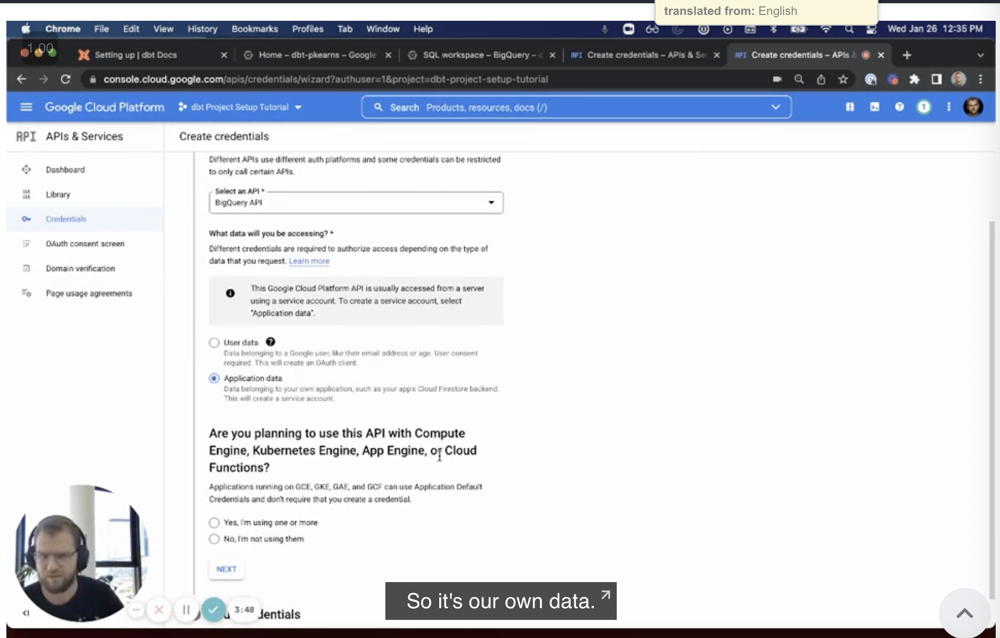

https://console.cloud.google.com/apis/credentials/wizard

simple setup
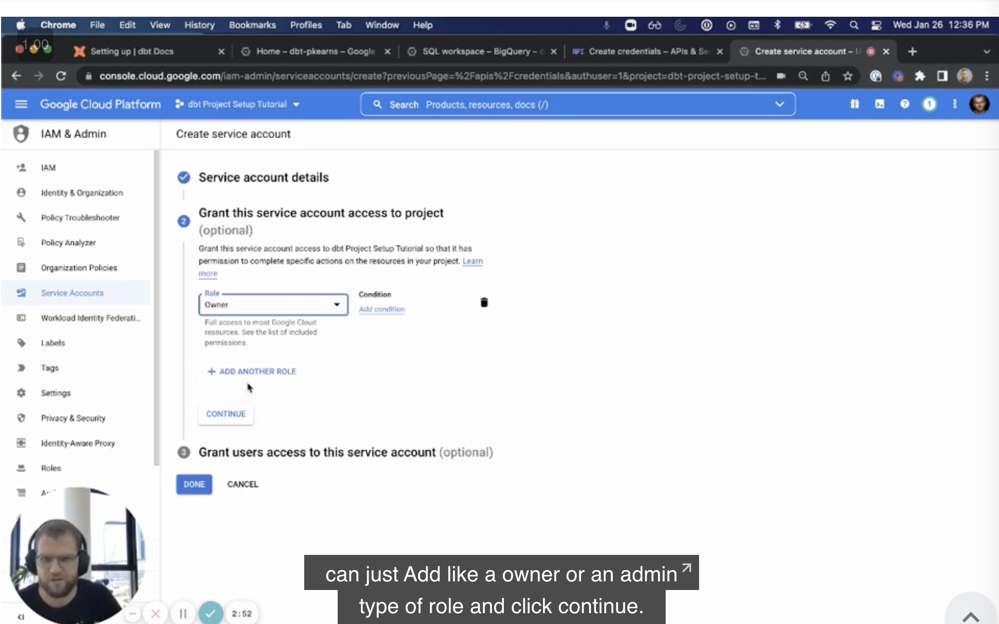

dbt-user
BigQuery Admin in the Role field

now you have the key
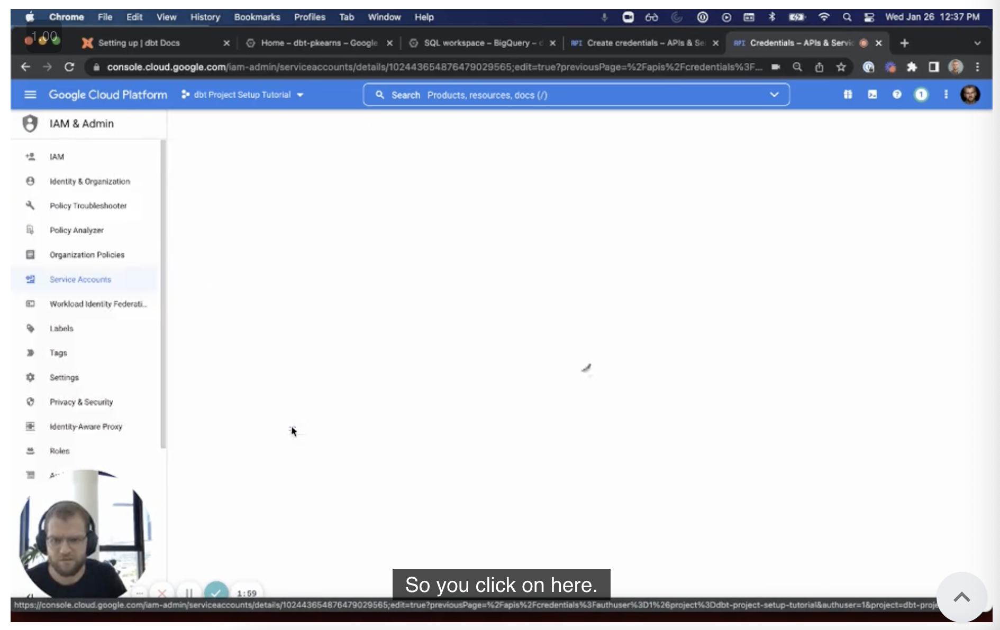

export the private key
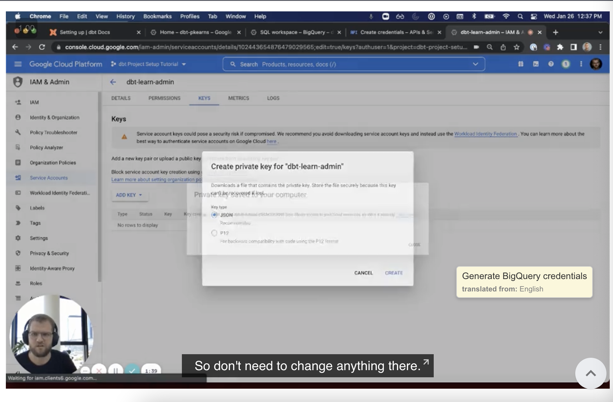

dbt-user-creds.json
> added to .gitignore

## Create a dbt Cloud account

https://cloud.getdbt.com/

settings 
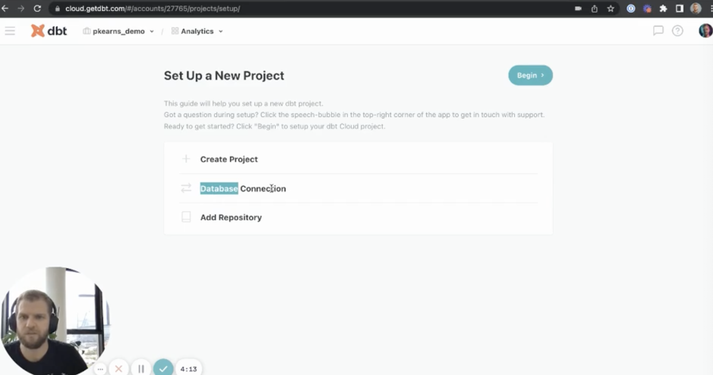

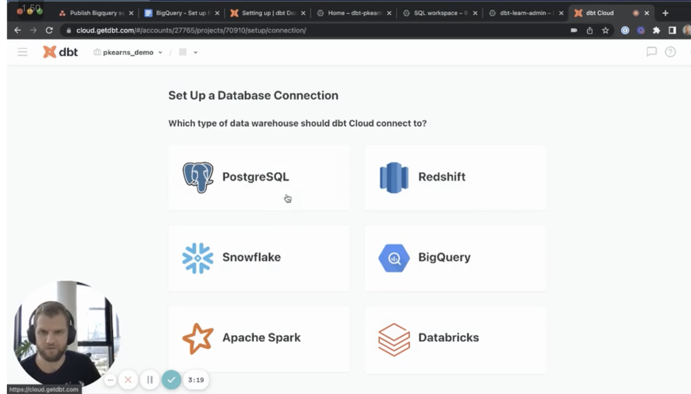

upload the json file exported

## Initialize your repository and start development

setup repo
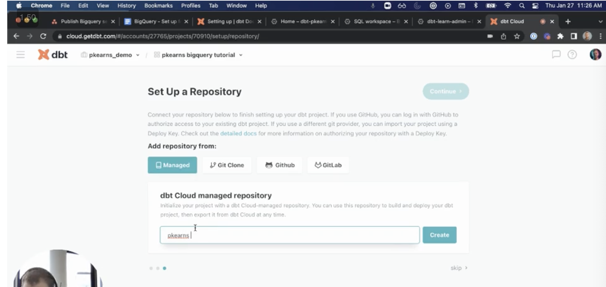

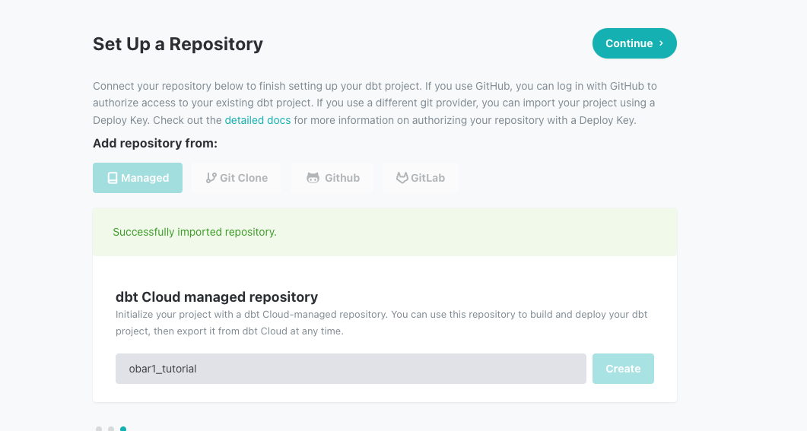

start developing

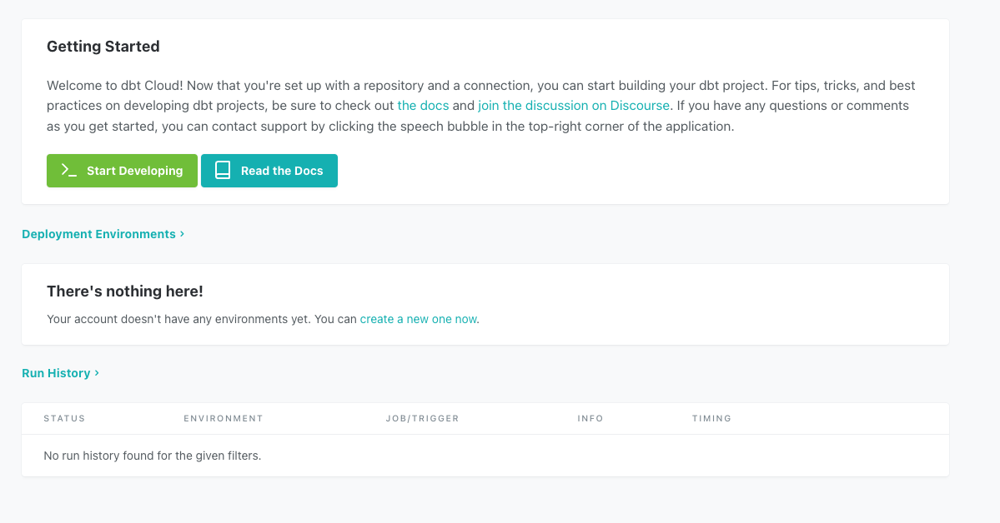

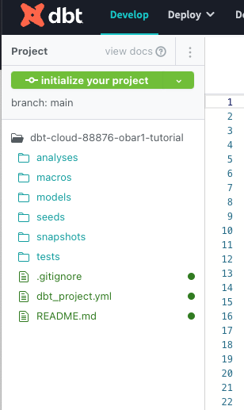
Initialize your project.

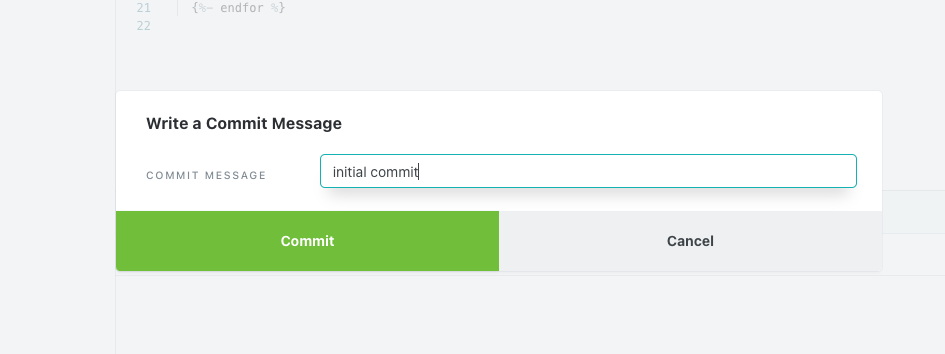

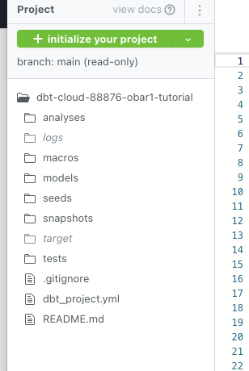
> color changed


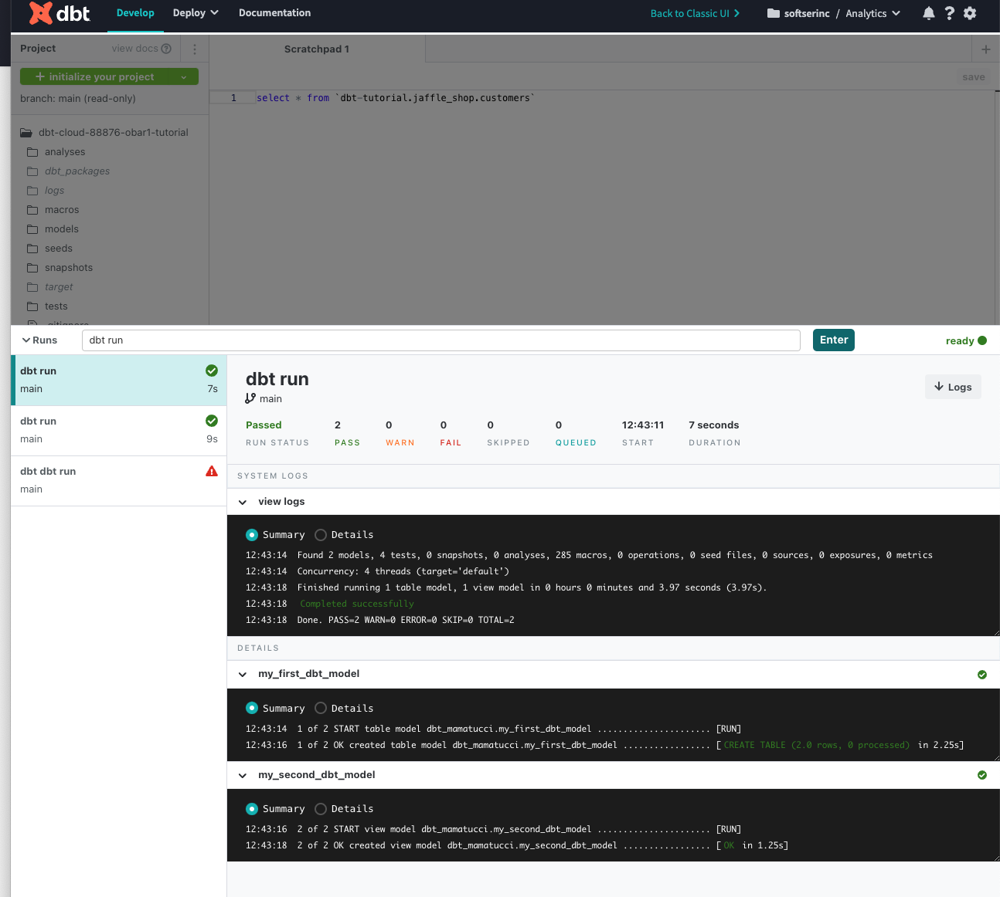
scratch pad and 
```
select * from `dbt-tutorial.jaffle_shop.customers`
```

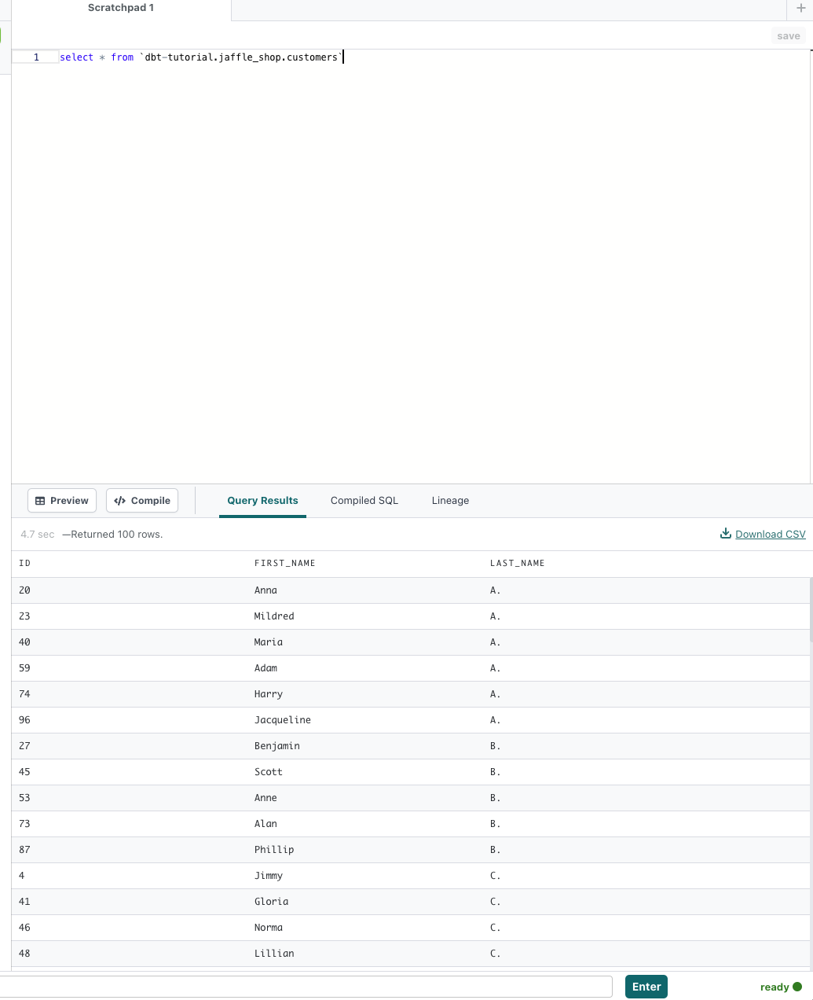 
```
dbt run
```

check bq

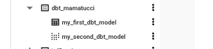
