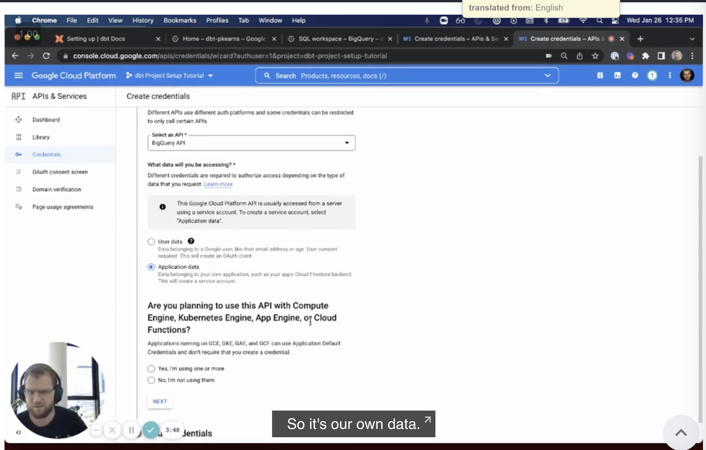
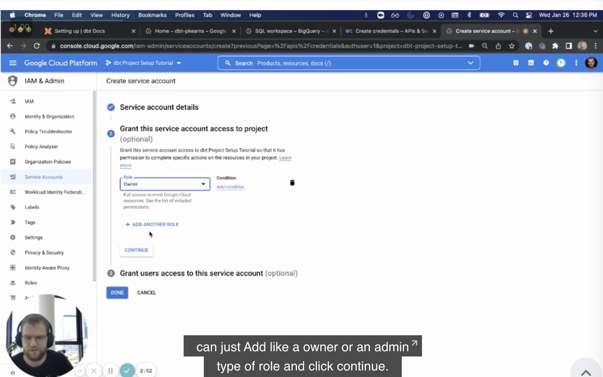
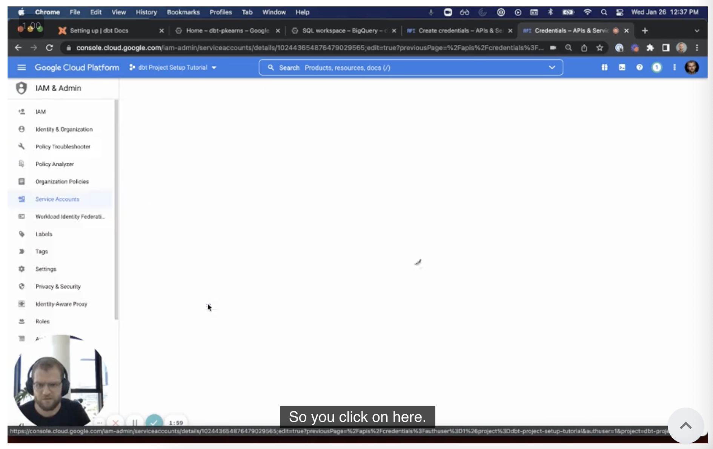
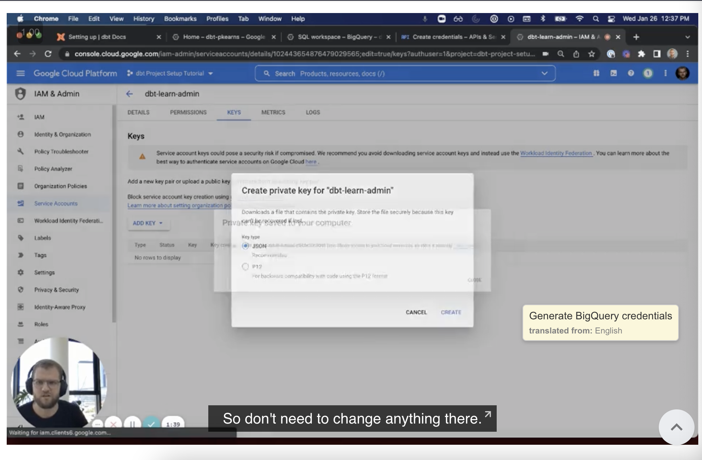
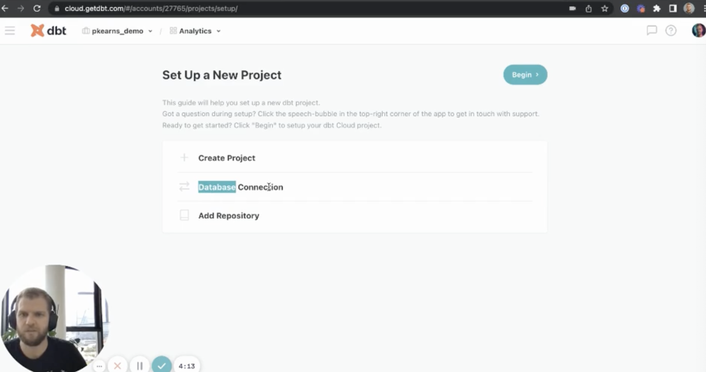
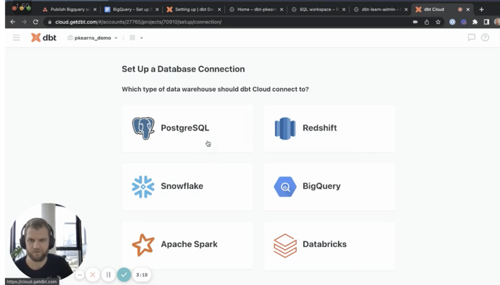
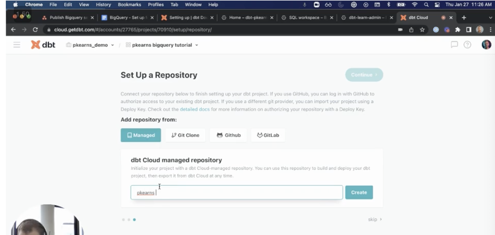

# <https:§§docs.getdbt.com§tutorial§getting-set-up§setting-up-bigquery>
> <https://docs.getdbt.com/tutorial/getting-set-up/setting-up-bigquery>

Set up and connect BigQuery

## Introduction

Setting up a new BigQuery instance
Accessing sample date in a public data set
Connecting dbt Cloud to BigQuery

## Prerequisites

need of gcp account

create a new project  - opt

## Loading data

access to public dataset
```
select * from `dbt-tutorial.jaffle_shop.customers`;
select * from `dbt-tutorial.jaffle_shop.orders`;
select * from `dbt-tutorial.stripe.payment`;
```

create dataset
jaffle_shop
stripe

## Connecting to dbt Cloud

Generate BigQuery credentials

create bq api key


simple setup


now you have the key


export the private key


go to dbt cloud

settings 




upload the json file exported

setup repo


